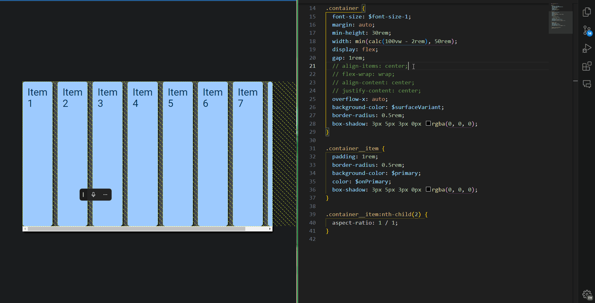

# Flexbox Layout

- Flexbox is a *one-dimensional layout* method for laying out items in rows or columns.

- By default, flex items size themselves based on their content. This can be changed with the `flex` property which is a shorthand for `flex-grow`, `flex-shrink` and `flex-basis` properties.
- Flex items can be set to grow with the available space with `flex-grow` property.

## How do Flexbox and Grid differ?

| Flexbox | Grid |
| --- | --- |
| One-dimensional | Two-dimensional |
| Flex items are laid out along either the main axis or the cross axis (with `flex-wrap` set to `wrap` it can appear two dimensional) | Grid items are laid out in rows and columns |
| Flex items by default use their own content to determine their size | Grid items can be sized using fixed or flexible units |
| No fixed number of rows or columns | Fixed number of rows and columns |
| Suitable for items with varying sizes | Suitable for items with the similar size |
