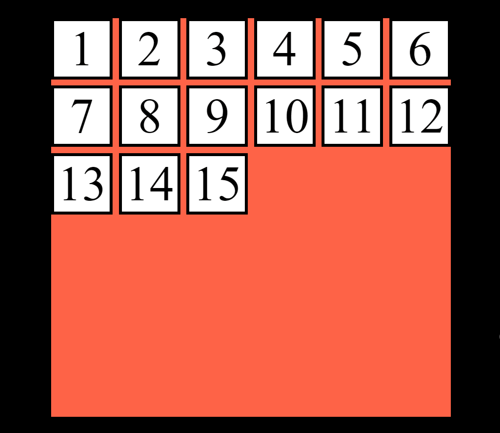

# CSS Grid auto-fit property

The grid template columns property can be used to define the number of columns in a grid layout. The auto-fit keyword can be used to automatically fit columns into the available space. The columns will be automatically created or removed to fill the available space.

<div style="text-align:center">
  
</div>

```css
.box {
  background: transparent;
  background-color: tomato;
  display: grid;
  width: calc(4*30px + 5*2px);
  grid-template-rows: repeat(6, 20px);
  grid-template-columns: repeat(auto-fit, 20px);
  gap: 2px;
}
```
