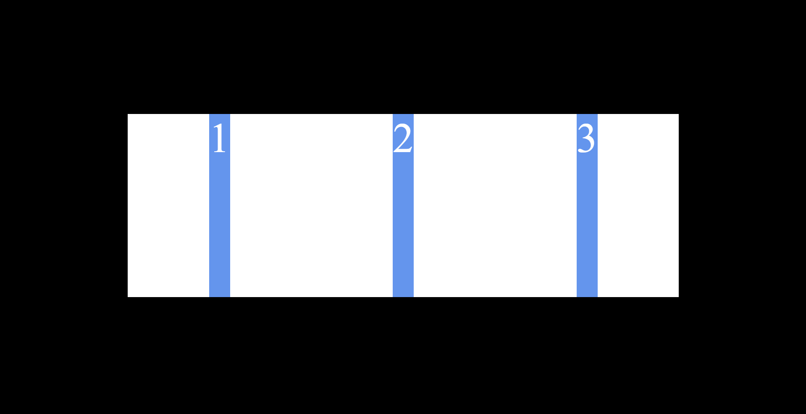

# 1. Aligning Items in a CSS Grid

- [1. Aligning Items in a CSS Grid](#1-aligning-items-in-a-css-grid)
  - [1.1. Default Alignment (Stretch)](#11-default-alignment-stretch)
  - [1.2. Aligning Items Horizontally Only](#12-aligning-items-horizontally-only)
  - [1.3. Aligning Items Horizontally and Vertically](#13-aligning-items-horizontally-and-vertically)

These examples use a `.box` class to create a grid and a `.box-element` class to create grid items.

## 1.1. Default Alignment (Stretch)

The default alignment of grid items is `stretch`. This means that grid items will stretch to fill the entire grid cell.


```css
.box {
  width: 210px;
  min-height: 70px;
  background-color: #fff;
  display: grid;
  grid-template-columns: repeat(3, 1fr);
  justify-items: stretch;
}

.box-element {
  background-color: cornflowerblue;
  color: #fff;
}
```

## 1.2. Aligning Items Horizontally Only

You can align grid items horizontally using the `justify-items` property. The default value is `stretch`, but you can also use `start`, `end`, `center`, or `space-around`. **Note:** *The `.box-element` still stretches vertically to fill the entire grid cell.*



```css
.box {
  width: 210px;
  min-height: 70px;
  background-color: #fff;
  display: grid;
  grid-template-columns: repeat(3, 1fr);
  justify-items: center;
}

.box-element {
  background-color: cornflowerblue;
  color: #fff;
}
```

## 1.3. Aligning Items Horizontally and Vertically

You can align grid items horizontally and vertically using the `justify-items` and `align-items` properties. The default value is `stretch`, but you can also use `start`, `end`, `center`, or `space-around`.


```css
.box {
  width: 210px;
  min-height: 70px;
  background-color: #fff;
  display: grid;
  grid-template-columns: repeat(3, 1fr);
  justify-items: center;
  align-items: center;
}

.box-element {
  background-color: cornflowerblue;
  color: #fff;
}
```
