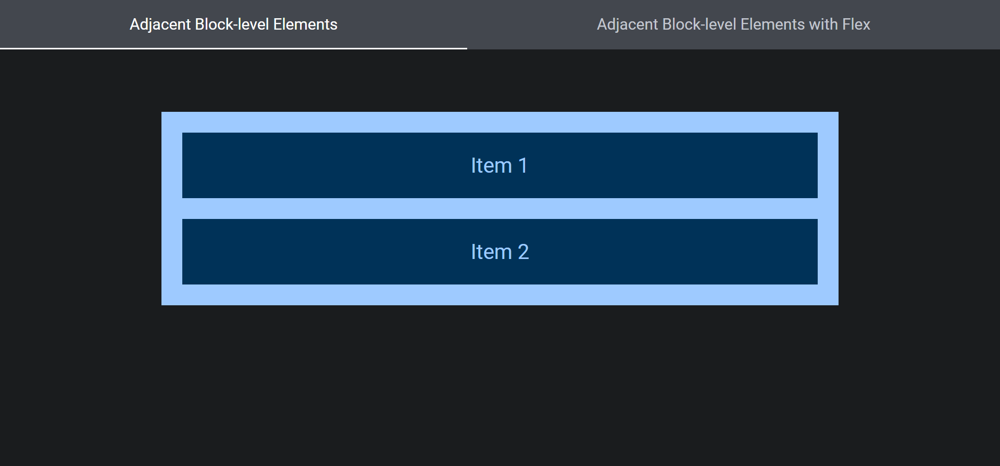
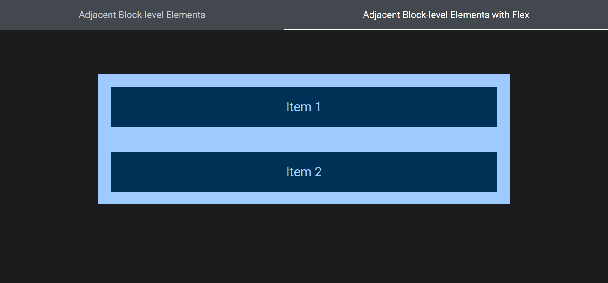

# Margin Collapse

## What is margin collapse?

Margin collapse is a phenomenon where the vertical margins of two elements are combined to form a single margin.



### Adjacent Block-level Elements

The `.container__item` block-level elements have their bottom and top margins collapsed. The total margin is the largest of the two margins. In this case, the total margin is `$container__item-margin`.

```scss
$container__item-margin: 1em;
.container__item {
  margin: $container__item-margin;
  padding: 1.1em;
  font-size: $font-size-h1;
  text-align: center;
  background-color: $onPrimary;
  color: $primary;
  outline: $container__item-margin solid $primary;
}
```

> Note: The `outline` property is used to show the margin.

## How to prevent margin collapse?

1. Use `flexbox` or `grid` to create space between elements. `flexbox` and `grid` do not have margin collapse.
2. Use `padding` instead of `margin` to create space between elements.

### Flexbox Solution

The `.container--flex` element is the new parent of the `.container__item` elements and now there is no margin collapse and total margin between them is `2 x $container__item-margin`.



```scss
.container--flex {
  @include container;
  margin: 7em auto;
  display: flex;
  flex-direction: column;
  justify-content: center;
}
```
