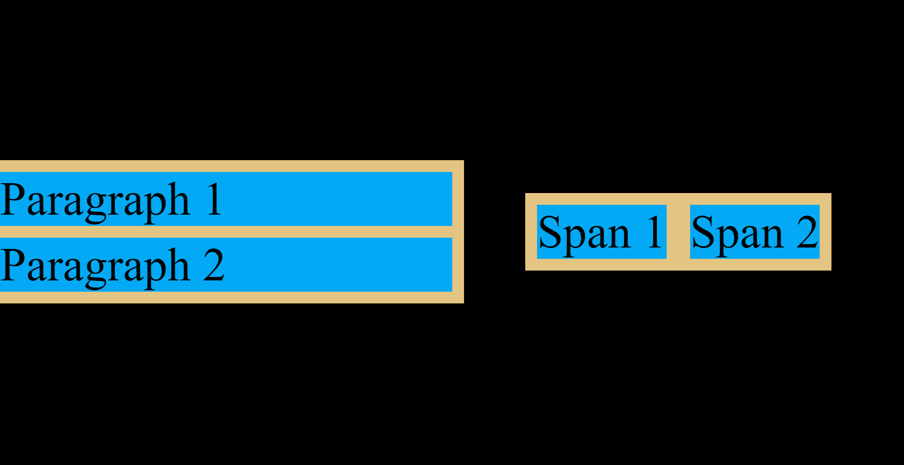

# Margin Collapse

## What is margin collapse?

Margin collapse is a phenomenon where the vertical margins of two elements are combined to form a single margin.



### Example 1 - Adjacent Block-Level Elements

The `.p-block` block-level elements have their top and bottom margins collapsed. The total margin is the largest of the two margins. In this case, the total margin is 4px.

```css
.p-block {
    background-color: #03A9F4;
    min-width: 100%;
    margin-top: 4px;
    margin-bottom: 4px;
    outline: 4px solid #e4c482;
}
```

### Example 2 - Adjacent Inline Elements

The `.span-inline` inline elements do not have their margins collapsed as this only happens vertically. The total margin is the sum of the two margins. In this case, the total margin is 8px.

```css
.span-inline {
    background-color: #03A9F4;
    margin-left: 4px;
    margin-right: 4px;
    outline: 4px solid #e4c482;
}
```
