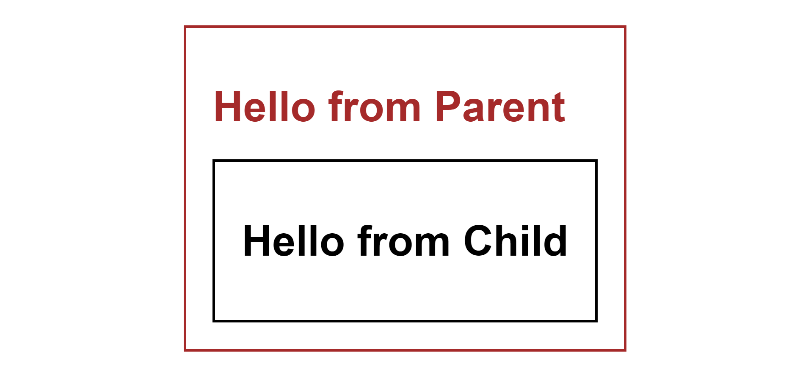

# CSS Selectors: Direct Descendant and All Descendants

## Direct Descendant Selector

Selects only the direct `h1` element children of the parent element.

<div style="text-align:center">

</div>

```css
.parent>h1 {
  color: brown;
}
```

## All Descendants Selector

Selects all the `h1` element children of the parent element.

<div style="text-align:center">

</div>

```css
.parent h1 {
  color: brown;
}
```
