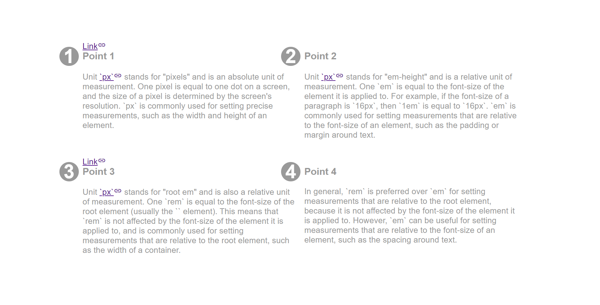

# :has() Pseudo-class

The `:has()` pseudo-class takes a selector list as its argument, and selects an element if any of the selectors in the list are true for that element.

<div style="text-align:center">

</div>

```scss
.section:has(.link) {
  position: relative;
}

.section > .link {
  position: absolute;
  top: 0;
  margin: 0;
}
```

Only when the `.section` element has a `.link` element as a child, it is positioned *relatively* so that the `.link` element that is positioned *absolutely* is relative to `.section`.
