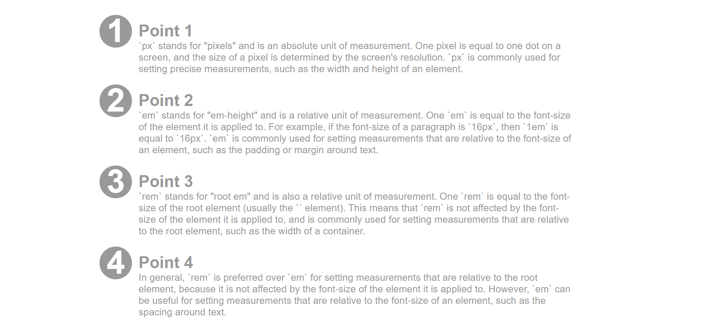

# Use of `::before` pseudo-selector to create numbering for headings

This example shows how to use the `::before` pseudo-selector to create numbering for headings.

<div style="text-align:center;">

</div>

<div style="display:flex; justify-content: space-evenly;">

```css
.counter {
  color: #999;
  margin: 10em;
  font-size: 1.5em;

  counter-reset: section;
}

.section {
  position: relative;
  margin-bottom: 0;
  /* font-size: 1.5em; */
}

.section::before {
  position: absolute;
  counter-increment: section;
  content: counter(section);
  font-size: 2em;
  inset: -0.2em 0 0 -1.2em;
  /* inset: 0; !Don't */

  background: #999;
  color: #fff;
  width: 1em;
  text-align: center;
  height: 1em;
  border-radius: 50%;
  line-height: 1em;
}
```

```html
  <div class="counter">
    <h3 class="section">Point 1</h3>
    <p>Text</p>
    <h3 class="section">Point 2</h3>
    <p>Text</p>
    <h3 class="section">Point 3</h3>
    <p>Text</p>
    <h3 class="section">Point 4</h3>
    <p>Text</p>
  </div>
```

</div>
